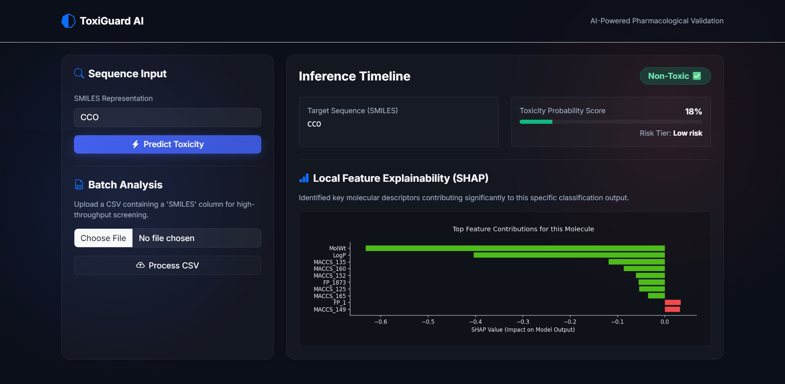
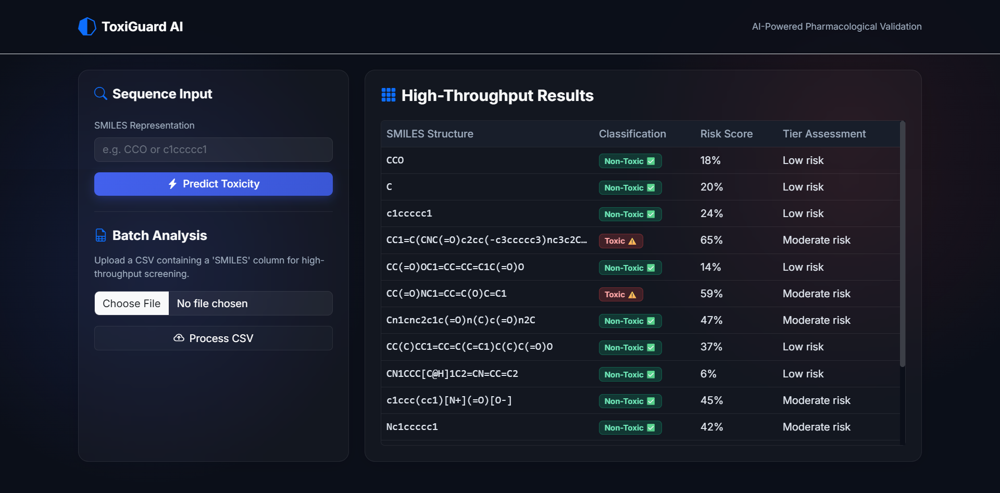
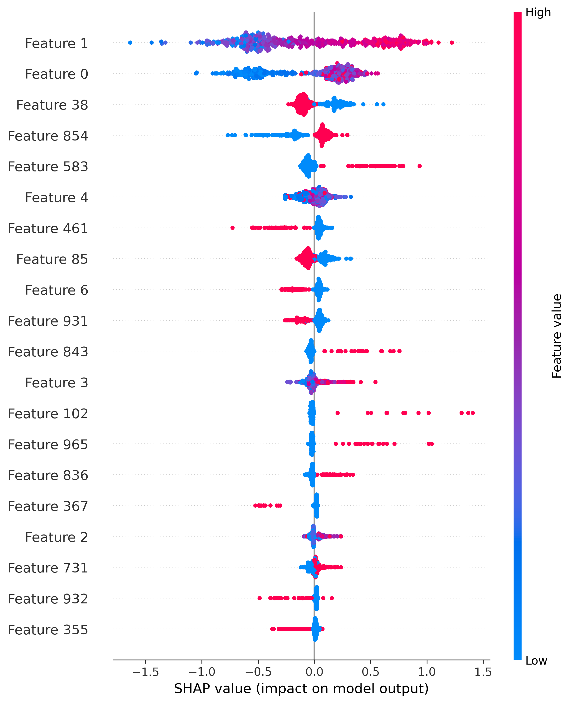

# 🛡️ ToxiGuard AI

### 🚀 AI-Powered Toxicity Detection System using NLP & Machine Learning


--

## 👩‍💻 Developed By
**Shraddha Jain**  
B.Tech Computer Science Engineering  

---

## 📌 Project Overview

ToxiGuard AI is an intelligent system designed to detect toxic, abusive, and harmful text using Natural Language Processing (NLP) and Machine Learning.

It supports:
- ✅ Real-time single text prediction  
- ✅ Batch CSV analysis  
- ✅ Model explainability using SHAP  

---

## ✨ Key Features

- 🔍 Toxicity Detection (Real-time)
- 📊 Batch Processing (CSV Upload)
- 🧠 Explainable AI (SHAP Visualization)
- ⚡ Fast Predictions using XGBoost
- 🌐 Simple Web Interface

---

## 📊 Model Performance

- **Accuracy:** 94%  
- **Model Used:** XGBoost  
- **Dataset:** Jigsaw Toxic Comment Dataset  

---

## 🧠 How It Works

1. Input text from user  
2. Text preprocessing (cleaning, tokenization)  
3. Feature extraction using TF-IDF  
4. Prediction using trained XGBoost model  
5. Explainability using SHAP values  

---

## 🖼️ Project Screenshots

| Single Prediction | Batch Results | SHAP Explainability |
|:---:|:---:|:---:|
|  |  |  |
## 🏗️ Tech Stack

- **Frontend:** HTML, CSS  
- **Backend:** Python (Flask)  
- **ML Model:** XGBoost  
- **Libraries:** Pandas, NumPy, Scikit-learn, SHAP  

---

## 🚀 Installation & Setup

### 1️⃣ Clone the Repository
```bash
git clone https://github.com/shraddhajain0989/ToxiGuard-AI.git
cd ToxiGuard-AI
2️⃣ Create Virtual Environment
python -m venv venv
venv\Scripts\activate
3️⃣ Install Dependencies
pip install -r requirements.txt
4️⃣ Run the Application
python app.py
